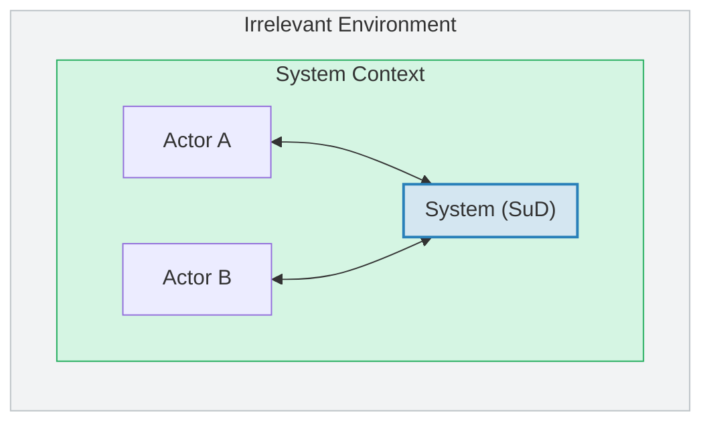

# EU 2: Fundamental Principles of Requirements Engineering

::: info Official Reference
**IREB CPRE-FL Syllabus v3.3.0** — Educational Unit 2 (L2, 1 hour 30 minutes)
[Download syllabus](https://cpre.ireb.org/en/downloads-and-resources/downloads)
:::

  <strong>Exam weight:</strong> ~8.6% of points (4 questions, 6 points). Know all nine principles by name and understand why each matters.

## 2.1 Overview of Principles (L1)

Requirements Engineering (RE) is governed by a set of fundamental principles which apply to all tasks, activities, and practices in RE. The following nine principles form the basis for the practices presented in the subsequent Educational Units.

| # | Principle | One-Line Summary |
|---|-----------|-----------------|
| 1 | **Value orientation** | Requirements are a means to an end, not an end in itself |
| 2 | **Stakeholders** | RE is about satisfying the stakeholders' desires and needs |
| 3 | **Shared understanding** | Successful systems development is impossible without a common basis |
| 4 | **Context** | Systems cannot be understood in isolation |
| 5 | **Problem – Requirement – Solution** | An inevitably intertwined triple |
| 6 | **Validation** | Non-validated requirements are useless |
| 7 | **Evolution** | Changing requirements are no accident, but the normal case |
| 8 | **Innovation** | More of the same is not enough |
| 9 | **Systematic and disciplined work** | We can't do without in RE |

## 2.2 The Principles Explained (L2)

### Principle 1 — Value Orientation

*Requirements are a means to an end, not an end in itself.*

The value of a requirement equals its **benefit** minus the **cost** for eliciting, documenting, validating, and managing it.

The benefit of a requirement is the degree to which it contributes to:

- Building systems which satisfy the desires and needs of stakeholders
- Reducing the risk of failure and costly rework when developing the system

Spending two weeks writing a 50-page specification for a throwaway prototype adds cost without proportional benefit. A few user stories on index cards might deliver the same value at a fraction of the cost. Value orientation means choosing the level of formality that matches the situation.

### Principle 2 — Stakeholders

*RE is about satisfying the stakeholders' desires and needs.*

Properly dealing with stakeholders is a core task of RE. Key points:

- Every stakeholder has a **role** in the context of the system (e.g., user, client, customer, operator, regulator)
- A stakeholder may have **more than one role** at the same time
- For roles with too many individuals or unknown individuals, **personas** can be defined as substitutes
- It is not sufficient to consider only end users or customers — doing so risks missing critical requirements from other stakeholders
- Users who provide feedback about a system in use should also be considered as stakeholders

Stakeholders may have different needs and viewpoints, resulting in **conflicting requirements**. Identifying and resolving such conflicts is a task of RE.

### Principle 3 — Shared Understanding

*Successful systems development is impossible without a common basis.*

RE creates, fosters, and secures shared understanding between stakeholders, Requirements Engineers, and developers. There are two forms:

| Form | How It Is Achieved |
|------|-------------------|
| **Explicit** shared understanding | Documented and agreed requirements |
| **Implicit** shared understanding | Shared knowledge about needs, visions, context, etc. |

**Enablers** for shared understanding include domain knowledge, previous successful collaboration, shared culture and values, and mutual trust.

**Obstacles** include geographic distance, outsourcing, or large teams with high turnover.

Proven practices for achieving shared understanding include:

- Creating **glossaries** (EU 3, Section 3.5)
- Creating **prototypes** (EU 3, Section 3.7)
- Using an existing system as a **reference point**

The most important practice for reducing the impact of misunderstandings is using a process with **short feedback loops** (EU 5).

### Principle 4 — Context

*Systems cannot be understood in isolation.*

Systems are embedded in a context. Without understanding that context, it is impossible to specify a system properly.

The **system context** is the part of a system's environment that is relevant for understanding the system and its requirements. The **system boundary** separates a system from its surrounding context. The **context boundary** separates the RE-relevant part of the environment from the rest of the world.

When specifying a system, the Requirements Engineer must also consider:

- **Changes in the context** that may impact system requirements
- **Real-world requirements** relevant for the system and how to map them to system requirements
- **Context assumptions** that must hold for making the system work

### Principle 5 — Problem, Requirement, Solution

*An inevitably intertwined triple.*

| Concept | Description |
|---------|-------------|
| **Problem** | Stakeholders are not satisfied with the situation as is |
| **Requirement** | What stakeholders need in order to address the problem |
| **Solution** | A socio-technical system that satisfies the requirements |

These three do **not** necessarily occur in a fixed order. Solution ideas may create user needs which have to be worked out as requirements — this is typically the case when innovating.

Although closely intertwined, Requirements Engineers aim to **separate** problems, requirements, and solutions from each other as far as possible when thinking, communicating, and documenting. This separation of concerns makes RE tasks easier to handle.

### Principle 6 — Validation

*Non-validated requirements are useless.*

Validation of requirements must start already during RE, not just when the system is deployed. The Requirements Engineer must check whether:

- **Agreement** about the requirements has been achieved among the stakeholders
- The stakeholders' desires and needs are **adequately covered** by the requirements
- The **context assumptions** are reasonable

::: warning Exam Distinction
**Validation** checks whether the requirements correctly reflect stakeholder intentions (*"Are we building the right thing?"*). **Verification** checks whether an artifact conforms to its specification (*"Are we building the thing right?"*).
:::

### Principle 7 — Evolution

*Changing requirements are no accident, but the normal case.*

Systems and their requirements are subject to evolution. Change requests may be caused by:

- Changed business processes
- Competitors launching new products or services
- Clients changing their priorities or opinions
- Changes in technology
- Changes of laws or regulations
- Feedback from system users asking for new or changed features
- Detection of faults in previously elicited requirements

As a consequence, Requirements Engineers must pursue two seemingly contradictory goals:

1. **Permit requirements to change**
2. **Keep requirements stable**

How to achieve this balance is discussed in EU 6, Section 6.7.

### Principle 8 — Innovation

*More of the same is not enough.*

Giving the stakeholders exactly what they want misses the opportunity to build systems that satisfy their needs **better than they expect**. Good RE strives not just to satisfy stakeholders, but to make them happy, excited, or feel safe.

RE shapes innovative systems:

- **On a small scale** — by striving for exciting new features and ease of use
- **On a large scale** — by striving for disruptive new ideas

Techniques for fostering innovation in RE are discussed in EU 4, Section 4.2.

### Principle 9 — Systematic and Disciplined Work

*We can't do without in RE.*

There is a need to employ suitable processes and practices for systematically eliciting, documenting, validating, and managing requirements, **regardless** of the actual development process being used. Even when a system is developed in an ad-hoc fashion, a systematic approach to RE improves quality.

There is no single process or practice that works in every situation. Systematic and disciplined work means that Requirements Engineers:

- **Adapt** their processes and practices to the given problem, context, and environment
- **Do not always use** the same process and set of practices
- **Do not re-use** processes from past successful work without reflection

For every RE endeavor, processes, practices, and work products must be chosen that fit the specific situation best.

## Practice Quiz

<Quiz :questions="questions" />
