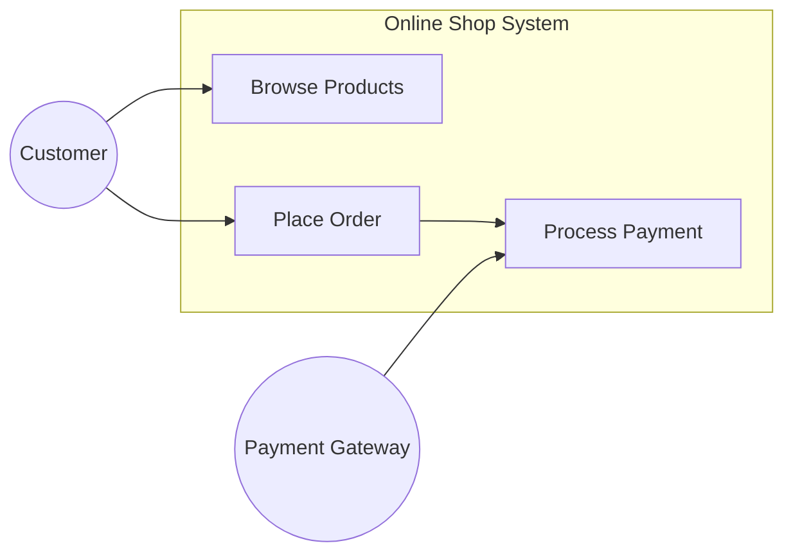
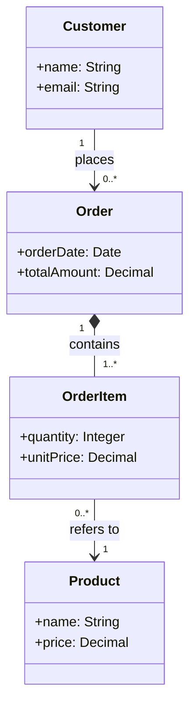
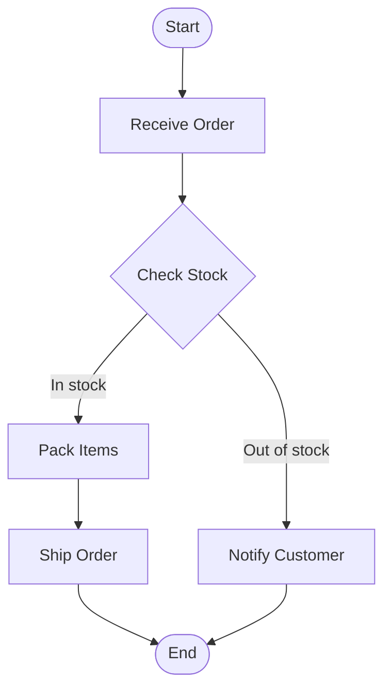
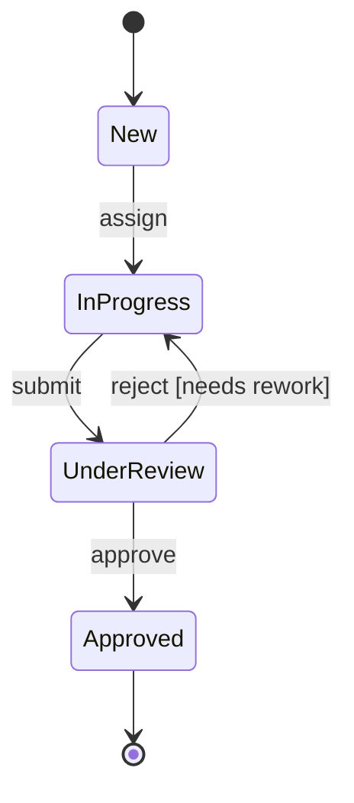

# EU 3: Model-Based Work Products

::: info Official Reference
**IREB CPRE-FL Syllabus v3.3.0** — Educational Unit 3, Section 3.4 (L3)
[Download syllabus](https://cpre.ireb.org/en/downloads-and-resources/downloads)
:::

See also: [Work Product Basics](03a-work-product-basics) | [Natural Language & Templates](03b-natural-language)

## 3.4.1 The Role of Models in Requirements Engineering (L2)

A **model** is an abstract representation of an existing part of reality or a part of reality to be created. With respect to a model, the modeled part of reality is called the **original**.

In RE, models help to understand the **relationships and interconnections** between requirements and provide an **overview** of a set of requirements. This is achieved by:

- Focusing on **some aspects** (e.g., behavior) while abstracting from others
- Using a **graphic notation** that supports gaining an overview

### Advantages of Models over Natural Language

- Relationships between requirements are **easier to understand** with graphic models
- Focusing on a single aspect **reduces cognitive load**
- Modeling languages have **restricted syntax** which reduces ambiguities and omissions

### Limitations of Models

- Keeping models that focus on different aspects **consistent** with each other is challenging
- Information from different models needs to be **integrated** for complete understanding
- Models focus primarily on **functional requirements**; most quality requirements and constraints cannot be expressed in models with reasonable effort
- Not every relevant item of information can be expressed in a model's restricted syntax

Therefore, requirements models and requirements in natural language are **frequently combined**.

### Uses of Models in RE

- **Specifying** (primarily functional) requirements, partly or completely
- **Decomposing** complex reality into well-defined, complementing aspects
- **Paraphrasing** textual requirements to improve comprehensibility
- **Validating** textual requirements to uncover omissions, ambiguities, and inconsistencies

### Modeling Languages

Modeling languages are used to express models. Standardized languages include **UML** and **BPMN**. When a non-standard language is used, a legend explaining its syntax and semantics is required.

## 3.4.2 Modeling Context (L2)

Context models specify a system, the **actors** in the system context, and the interaction between them. They also sketch the **interfaces** between the system and its context.

**Context diagrams** are the graphic notation for context models. There is no single standardized notation — diagrams from structured analysis or tailored box-and-line diagrams can be used.

In **UML**, use case diagrams provide a means for modeling context:

**Use cases** model the dynamic interaction between an actor and the system from the actor's perspective. They are mostly written using form templates or expressed with UML activity diagrams.

## 3.4.3 Modeling Structure and Data (L3)

Models that focus on **structure and data** specify requirements for static structural properties of a system or domain.

- **Domain models** specify the business objects and their relationships in a domain
- **Class models** specify the classes of a system, their attributes, and relationships

Both can be expressed with **UML class diagrams**.

### Key UML Class Diagram Elements

| Element | Notation | Meaning |
|---------|----------|---------|
| **Class** | Rectangle with name, attributes, operations | An entity the system must know about |
| **Association** | Line between classes | A relationship; may have a name and multiplicity |
| **Multiplicity** | Numbers at association ends (1, 0..1, 0..\*, 1..\*) | How many instances can participate |
| **Aggregation** | Hollow diamond | Weak "has-a" — part can exist independently |
| **Composition** | Filled diamond | Strong "has-a" — part cannot exist without the whole |
| **Generalization** | Arrow with hollow triangle | Inheritance — subclass inherits from superclass |

## 3.4.4 Modeling Function and Flow (L3)

Models that focus on **function and flow** specify the sequence of actions required to produce results from inputs, or actions in a business process including control flow and responsibilities.

**Activity models** are expressed with **UML activity diagrams**:

### Key Activity Diagram Elements

| Element | Symbol | Meaning |
|---------|--------|---------|
| **Action** | Rounded rectangle | A step in the process |
| **Decision** | Diamond | A branching point based on a condition |
| **Fork** | Thick bar | Splits flow into parallel paths |
| **Join** | Thick bar | Synchronizes parallel paths back into one |
| **Initial node** | Filled circle | Start of the activity |
| **Final node** | Circle with inner filled circle | End of the activity |
| **Swim lanes** | Vertical or horizontal partitions | Who is responsible for which action |

**Process models** describe business or technical processes using activity diagrams or BPMN. At the Foundation Level, only UML activity diagrams are used for process modeling.

## 3.4.5 Modeling State and Behavior (L2)

Models that focus on **state and behavior** specify requirements for how a system or component reacts to events depending on its current state.

**State machines** model events that trigger transitions from one state to another and the actions performed during transitions. In UML, they are expressed with **state machine diagrams** (also called state diagrams).

### Transition Syntax

A transition in a state machine diagram has the form:

**event [guard] / action**

| Part | Description |
|------|-------------|
| **Event** | What triggers the transition |
| **Guard** | A boolean condition that must be true for the transition to occur |
| **Action** | What happens when the transition fires |

**Statecharts** are state machines with states that are decomposed hierarchically and/or orthogonally — they extend basic state machines for more complex behavior modeling.

## 3.4.6 Further Model Types in Requirements Engineering (L1)

At the Foundation Level, it suffices to know these additional model types and what they are used for:

| Model Type | Purpose |
|-----------|---------|
| **Goal models** | Represent goals, sub-goals, and their relationships. May include tasks, resources, actors, and obstacles |
| **Block definition diagrams** (SysML) | Can express context diagrams and model system structure |
| **Domain story models** | Model function and flow using domain-specific symbols to understand the application domain |
| **Interaction models** | Model dynamic interactions between objects or actors (e.g., UML sequence diagrams) |

## Practice Quiz

<Quiz :questions="questions" />
