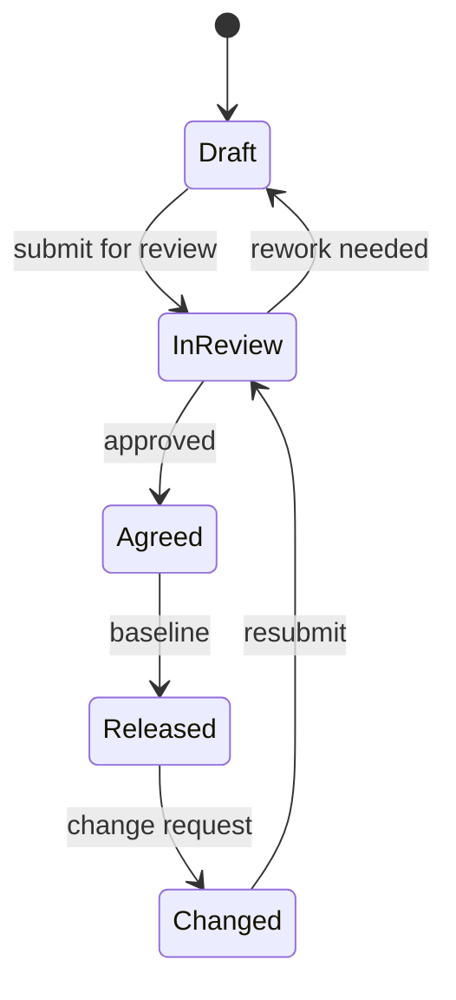

# EU 6: Management Practices for Requirements

::: info Official Reference
**IREB CPRE-FL Syllabus v3.3.0** — Educational Unit 6 (L2, 2 hours 30 minutes)
[Download syllabus](https://cpre.ireb.org/en/downloads-and-resources/downloads)
:::

  <strong>Exam weight:</strong> ~14.3% of points (6 questions, 10 points). Know the purpose of attributes, views, traceability, and how change handling differs between linear and agile.

## 6.1 What is Requirements Management? (L1)

**Requirements management** is the process of managing existing requirements recorded in various work products. This includes storing, changing, and tracing requirements.

Requirements management can happen in different ways and at different levels depending on the chosen development process and context. Regardless of circumstances, the task is to maintain requirements so that all roles in a project can work **effectively and efficiently**.

## 6.2 Life Cycle Management (L2)

Life cycle management refers to keeping track of all work products with respect to their **status**.

Each documented requirement and each work product has its own life cycle: it is created, then evaluated and refined before it is reviewed, reworked, consolidated, agreed, and so forth.

A **life cycle model** is required that defines:
- Each allowed life cycle **status**
- Each allowed **state transition**

The actual status of a work product should always be clear, including the history of its transitions.

## 6.3 Version Control (L2)

Version control tracks all work products during their evolution. Any change should be reflected by a **new version**. Versioning allows the history to be traced back to the origin and any earlier version to be restored.

**Three measures required:**

1. A **version number** to uniquely identify the version of a work product
2. A **history** of what was changed
3. A **concept for work product storage**

A version number typically consists of at least two parts: the **version** and the **increment** (e.g., 1.0, 1.1, 2.0).

## 6.4 Configurations and Baselines (L1)

A **requirements configuration** is a consistent set of work products that contain requirements. Each configuration is defined for a specific purpose and contains at most one version of each work product.

A **baseline** is a stable, change-controlled configuration of work products, used for release planning or other delivery milestones.

Configurations have five properties:

1. **Logical connection** — the work products belong together
2. **Consistency** — no contradictions between work products
3. **Uniqueness** — each work product appears at most once
4. **Unchangeability** — once baselined, the configuration is frozen
5. **Basis for reset** — can be used to restore a known state

## 6.5 Attributes and Views (L2)

### Requirements Attributes

**Requirements attributes** document important **metadata** for a work product. They enable team members and stakeholders to get the information they need at any point during the project.

The relevant set of attributes depends on the information needs of different stakeholders. Standards such as ISO/IEC/IEEE 29148 provide an overview of the most relevant attributes.

Common attributes include: ID, status, priority, source, author, version, risk, stability, complexity, and acceptance criteria.

### Views

A **view** is an excerpt from the total set of requirements containing only the content currently of interest. From a technical perspective, a view is a combination of **filter** and **sort** settings.

| View Type | Purpose |
|-----------|---------|
| **Selective** | Filter requirements based on attribute values (e.g., show only "high priority" items) |
| **Projective** | Show only specific attributes for each requirement (e.g., ID, title, and status only) |
| **Aggregating** | Summarize information across requirements (e.g., count of requirements per status) |

In practice, views are combinations of selective, projective, and aggregating views for creating **reports**.

## 6.6 Traceability (L1)

**Traceability** is the ability to trace a requirement back to its origin (stakeholders, documents, justifications) and forward to subsequent work products (e.g., test cases), as well as to other requirements it depends on.

Traceability is a prerequisite for requirements management and is often explicitly demanded by standards, laws, and regulations.

### Implicit vs. Explicit Traceability

| Type | How It Works |
|------|-------------|
| **Implicit** | Achieved by structuring and standardizing work products (e.g., naming conventions, directory structure) |
| **Explicit** | Achieved by relating work products to each other based on unique identifiers — using hyperlinks, references, matrices, tables, or graphs |

## 6.7 Handling Change (L1)

Requirements are not static. **Change management** is a controlled way to effect or deny a requested change to a work product. Changes happen due to many different reasons (Principle 7 — Evolution) and need to be handled properly.

| Approach | How Changes Are Handled |
|----------|------------------------|
| **Linear (plan-driven)** | A **Change Control Board** (in projects) or Change Advisory Board (in operations) decides on the change |
| **Iterative (agile)** | The **product owner** includes the change in the product backlog and prioritizes the new item accordingly |

## 6.8 Prioritization (L1)

Not all requirements are equally important. Assessment and prioritization determine the most relevant requirements for the next release or increment.

### Assessment Criteria

Common criteria include: business value, urgency, effort, dependencies, and others.

### Steps for Prioritization

1. Define major goals and constraints for the prioritization
2. Define desired assessment criteria
3. Define the stakeholders to be involved
4. Define the requirements to be prioritized
5. Select the prioritization technique
6. Perform prioritization

### Prioritization Technique Categories

| Category | Description |
|----------|-------------|
| **Ad-hoc techniques** | Quick, informal prioritization (e.g., MoSCoW) |
| **Analytical techniques** | Systematic, criteria-based prioritization (e.g., pairwise comparison, cost-value analysis) |

## Practice Quiz

<Quiz :questions="questions" />
