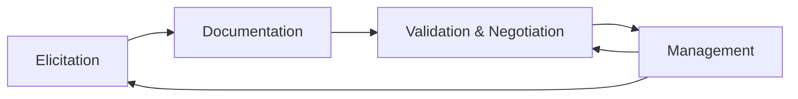

# Chapter 1: Introduction & Foundations

  <strong>Exam weight:</strong> ~7% of questions. Focus on definitions and the four core RE activities.

## What is Requirements Engineering?

**Requirements Engineering (RE)** is a systematic approach to eliciting, documenting, validating, and managing requirements. It forms the bridge between what stakeholders need and what the development team builds.

::: tip From Your Experience
As a BA, you already do RE — you gather needs, write specs, and manage changes. As a tester, you consume requirements to design test cases. IREB gives you a structured vocabulary for these activities.
:::

### Why RE Matters

The cost of fixing a defect increases dramatically the later it is found. A requirement error caught during elicitation might cost hours to fix; the same error found in production can cost millions.

RE reduces project risk by:
- Establishing a shared understanding between stakeholders and the development team
- Providing a basis for project planning, testing, and acceptance
- Minimizing rework caused by misunderstood or missing requirements

## Requirements: The IREB Definition

A **requirement** is a condition or capability needed by a stakeholder to solve a problem or achieve an objective, and that must be met or possessed by a system or system component.

Requirements describe **what** the system should do or how well it should perform — not **how** the system should be built internally.

## Types of Requirements

IREB classifies requirements into three types:

### 1. Functional Requirements

Functional requirements describe **what the system does** — the behavior, functions, and data it must provide.

**Example:** "The system shall allow registered users to search for products by name, category, or price range."

This describes a function the system must perform.

### 2. Quality Requirements (Non-Functional Requirements)

Quality requirements describe **how well** the system performs its functions. They specify properties like performance, usability, security, and reliability.

**Example:** "The search results page shall load within 2 seconds for 95% of queries under normal load."

This qualifies *how well* the search function must perform.

Common quality categories (remember these for the exam):
- **Performance** — response time, throughput
- **Usability** — learnability, accessibility
- **Reliability** — availability, fault tolerance
- **Security** — authentication, authorization, data protection
- **Maintainability** — modifiability, testability
- **Portability** — adaptability, installability

### 3. Constraints

Constraints are requirements that **restrict the solution space**. They are imposed by the organizational or technological environment and are typically non-negotiable.

**Example:** "The system shall be developed using the company's existing Oracle database infrastructure."

This is not a functional requirement — it restricts *how* the system is built.

Constraints can come from:
- **Organizational**: budget, timeline, process standards
- **Technological**: platform, programming language, existing systems
- **Legal/Regulatory**: data protection laws, industry standards
- **Physical**: hardware limitations, network bandwidth

::: warning Common Exam Trap
Don't confuse quality requirements with constraints. "Response time < 2 seconds" is a quality requirement (negotiable, measurable). "Must use Java" is a constraint (imposed, non-negotiable).
:::

## The Four Core RE Activities

IREB defines four core activities that form the requirements engineering process:

### 1. Elicitation
Discovering and gathering requirements from stakeholders and other sources. This includes identifying stakeholders, selecting appropriate techniques, and uncovering both explicit and implicit needs.

### 2. Documentation
Recording requirements in a structured way so they can be communicated, reviewed, and maintained. This includes natural language specifications, models, and templates.

### 3. Validation and Negotiation
Checking that documented requirements are correct, complete, and consistent, and resolving conflicts between stakeholders.

### 4. Management
Handling changes to requirements, maintaining traceability, prioritizing requirements, and versioning.

::: info Key Point
These activities are **not sequential**. In practice, they happen iteratively and concurrently. You might elicit new requirements while validating existing ones, or discover documentation gaps during management.
:::

## The Role of the Requirements Engineer

The requirements engineer acts as a **mediator** between stakeholders and the development team. Key responsibilities include:

- **Eliciting** stakeholder needs and expectations
- **Documenting** requirements clearly and unambiguously
- **Negotiating** and resolving conflicts between stakeholders
- **Validating** that requirements correctly reflect stakeholder intentions
- **Managing** requirement changes and traceability

The requirements engineer does *not* need to be a dedicated role — in many teams, BAs, product owners, or senior developers perform RE activities.

### Required Skills

| Skill Area | Examples |
|-----------|----------|
| **Analytical thinking** | Decomposing problems, identifying dependencies |
| **Communication** | Active listening, clear writing, facilitation |
| **Domain knowledge** | Understanding the business context |
| **Conflict resolution** | Mediating between competing stakeholder interests |
| **Self-organization** | Prioritizing work, managing time |

  <strong>Exam tip:</strong> The exam may ask about the responsibilities of a requirements engineer. Remember: they are a <em>mediator</em>, not a decision-maker. They facilitate agreement but don't make final business decisions.

## Practice Quiz

<Quiz :questions="questions" />

---

**Next:** [Chapter 2 — System & System Context →](/v2/chapters/02-system-context)
