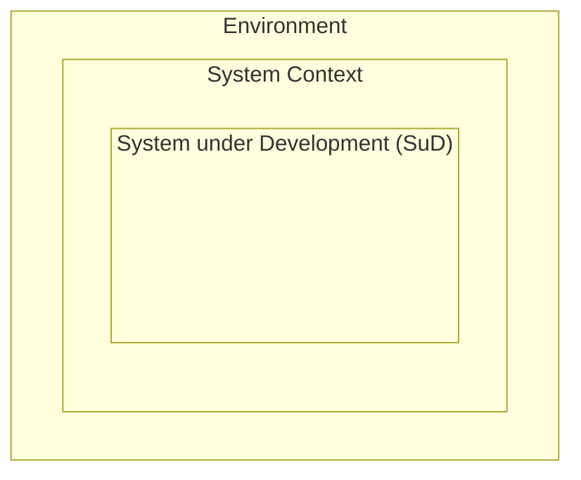
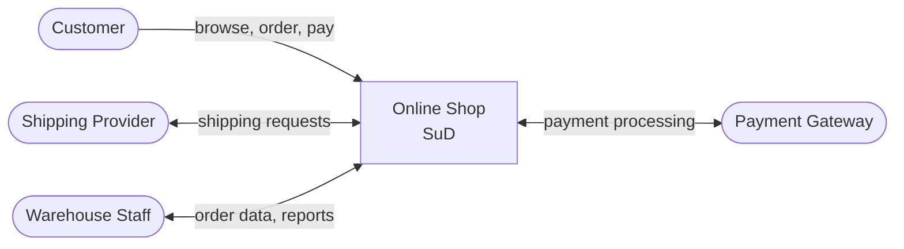

# Chapter 2: System & System Context

  <strong>Exam weight:</strong> ~7% of questions. Focus on the three boundaries and stakeholder identification.

## System and System Boundary

A **system** is a coherent set of elements (hardware, software, processes, people) organized to achieve a defined purpose. In IREB, we focus on the **System under Development (SuD)** — the system being specified.

The **system boundary** separates the SuD from everything else:

There are **three nested boundaries** to remember:
1. **System boundary** — separates the SuD from the system context
2. **Context boundary** — separates the relevant context from the irrelevant environment
3. The outer environment — everything beyond the context boundary

## System Context

The **system context** is the part of the environment that is relevant to understanding and defining the system's requirements. It includes:

- **People** who interact with the system (users, operators, administrators)
- **External systems** the SuD must integrate with
- **Processes** that the system supports or is part of
- **Documents and regulations** that govern the system
- **Physical environment** factors (hardware, network, location)

**Example — Online Shop System Context:**
- **Users**: Customers, warehouse staff, admin users
- **External systems**: Payment gateway, shipping provider API, email service
- **Processes**: Order fulfillment, returns handling
- **Regulations**: GDPR (data protection), PCI DSS (payment security)
- **Physical**: Deployed on AWS cloud, mobile and desktop browsers

### Why Context Matters

Failing to identify the full system context leads to:
- **Missing interfaces** — you forget an integration the system needs
- **Missing stakeholders** — you overlook someone affected by the system
- **Missing constraints** — you ignore regulations or technical limitations
- **Scope creep** — without a clear boundary, the system's scope keeps expanding

::: tip From Your Experience
As a tester, you know that integration test failures often come from misunderstood external interfaces. As a BA, you've seen projects derailed by late-discovered stakeholder concerns. Context analysis prevents both.
:::

## Context Boundary

The **context boundary** separates relevant aspects of the environment from irrelevant ones. Deciding what is "relevant" is a judgment call that the requirements engineer must make.

::: warning Key Exam Point
Setting the context boundary is a **critical RE decision**. Too narrow — you miss important influences. Too wide — you waste effort analyzing irrelevant factors.
:::

### Irrelevant Environment

Everything beyond the context boundary is considered **irrelevant** for the current RE effort. This doesn't mean it's unimportant in general — just that it doesn't affect the system's requirements.

**Relevant context** for an online shop: payment gateway, shipping API, customer database.

**Irrelevant environment**: the company's HR payroll system (no interaction with the shop), competitors' systems (no integration needed).

## Stakeholders

A **stakeholder** is a person or organization that has a direct or indirect influence on the system's requirements, or is affected by the system.

### Types of Stakeholders

| Type | Examples |
|------|----------|
| **Direct users** | End users who interact with the system daily |
| **Indirect users** | Managers who use reports from the system |
| **System owners** | Business sponsors, project managers |
| **Operators** | IT staff who deploy and maintain the system |
| **Regulators** | Legal compliance officers, auditors |
| **Developers** | The team building the system (consumers of requirements) |
| **Testers** | QA engineers who validate the system against requirements |
| **Affected parties** | People impacted by the system's operation without using it directly |

### Finding Stakeholders

Techniques for identifying stakeholders:

1. **Organizational charts** — identify people in relevant departments
2. **Existing system documentation** — find who interacts with predecessor systems
3. **Checklists** — use standardized role lists (sponsor, user, operator, etc.)
4. **Stakeholder maps** — visualize relationships between stakeholders and the system

**Critical principle:** Missing a stakeholder means missing their requirements. Late-discovered stakeholders are a major source of project risk.

**Practical example — Hospital Patient Portal:**

Obvious stakeholders: patients, doctors, nurses, hospital IT team.

Easily missed stakeholders:
- **Data protection officer** — patient data is highly sensitive
- **Insurance companies** — may need to integrate for claims
- **Emergency department staff** — different needs than regular care
- **Patients' family members** — may need proxy access
- **Accessibility advocates** — ensuring compliance with disability regulations

## Determining the System Context

The process of determining the system context involves:

1. **Identify stakeholders** — who interacts with or is affected by the system?
2. **Identify external systems** — what systems must the SuD interact with?
3. **Identify processes** — what business processes does the system support?
4. **Identify relevant standards and regulations** — what rules apply?
5. **Draw the context boundary** — what is relevant vs. irrelevant?
6. **Define the system boundary** — what is inside vs. outside the SuD?

### Context Diagram

A **context diagram** visualizes the system, its boundary, and the external entities it interacts with. It's a high-level view showing:
- The SuD as a central box
- External entities (stakeholders, systems) around it
- Data flows or interactions between them

## Practice Quiz

<Quiz :questions="questions" />

---

**Previous:** [← Chapter 1: Introduction & Foundations](/v2/chapters/01-introduction)
| **Next:** [Chapter 3: Requirements Elicitation →](/v2/chapters/03-elicitation)
