<script setup>
import Quiz from '../../.vitepress/theme/Quiz.vue'

const questions = [
  {
    text: 'What is the primary advantage of model-based documentation over pure natural language?',
    options: [
      'Models are always more complete than text',
      'Models reduce ambiguity for structural and behavioral aspects',
      'Models do not require any training to read',
      'Models replace the need for natural language documentation',
    ],
    answer: 1,
    explanation: 'Models use well-defined notations that reduce ambiguity, especially for structure and behavior. However, they complement — not replace — natural language, and they do require training to read.',
  },
  {
    text: 'In a use case diagram, what does an "include" relationship mean?',
    options: [
      'The included use case optionally extends the base use case',
      'The base use case always incorporates the behavior of the included use case',
      'The included use case replaces the base use case',
      'The included use case is an alternative to the base use case',
    ],
    answer: 1,
    explanation: 'An <<include>> relationship means the base use case ALWAYS incorporates the included use case — it\'s mandatory. The included behavior is factored out because it\'s shared by multiple base use cases.',
  },
  {
    text: 'In an activity diagram, what does a fork (thick horizontal bar splitting into multiple paths) represent?',
    options: [
      'A decision point where only one path is taken',
      'The start of parallel activities that execute concurrently',
      'The end of the activity',
      'An error handling branch',
    ],
    answer: 1,
    explanation: 'A fork splits the flow into concurrent paths — all outgoing branches execute in parallel. A join (another thick bar) synchronizes them. A decision (diamond) is where only one path is taken.',
  },
  {
    text: 'In a state machine diagram, what triggers a transition between states?',
    options: [
      'A class association',
      'An event, optionally with a guard condition',
      'A use case include relationship',
      'A data flow between entities',
    ],
    answer: 1,
    explanation: 'Transitions in state machines are triggered by events. A guard condition (in square brackets) can make the transition conditional: event [guard] / action.',
  },
  {
    text: 'In a class diagram, what does a multiplicity of "0..*" on an association mean?',
    options: [
      'Exactly zero instances',
      'Zero or more instances (optional, unbounded)',
      'At least one instance',
      'Exactly one instance',
    ],
    answer: 1,
    explanation: '"0..*" means zero or more — the association is optional and can have any number of instances. "1..*" means at least one. "1" means exactly one. "0..1" means zero or one.',
  },
  {
    text: 'Which diagram type is MOST suitable for documenting the data structure and relationships in a domain?',
    options: [
      'Activity diagram',
      'State machine diagram',
      'Class diagram / data model',
      'Use case diagram',
    ],
    answer: 2,
    explanation: 'Class diagrams (or entity-relationship diagrams) model the data structure — entities, their attributes, and relationships. Activity diagrams show processes, state machines show state changes, and use case diagrams show functionality overview.',
  },
  {
    text: 'What does an "extend" relationship in a use case diagram represent?',
    options: [
      'A mandatory behavior that is always executed',
      'An optional behavior that extends the base use case under certain conditions',
      'Inheritance between two actors',
      'A data flow between use cases',
    ],
    answer: 1,
    explanation: 'An <<extend>> relationship means the extending use case optionally adds behavior to the base use case — it\'s only triggered under specific conditions (at an extension point). Compare with <<include>> which is always executed.',
  },
]
</script>

# Chapter 6: Model-Based Documentation

<div class="exam-tip">
  <strong>Exam weight:</strong> This is the heaviest part of the ~40% documentation block. Expect many questions on UML diagram types, notation, and interpretation.
</div>

## Why Use Models?

Models complement natural language by providing:

- **Precision** — formal notation reduces ambiguity
- **Abstraction** — focus on relevant aspects, hide details
- **Different perspectives** — structure, behavior, interaction
- **Communication** — visual representations are easier to discuss

<div class="key-concept">

Models don't replace natural language — they supplement it. Use natural language for context, rationale, and details that models can't express. Use models for structure and behavior that text describes poorly.

</div>

## Overview of Model Types

| Model Type | Purpose | Shows |
|-----------|---------|-------|
| **Use case diagram** | Functional overview | What the system does for its actors |
| **Activity diagram** | Process/workflow | Step-by-step flow with decisions and parallelism |
| **State machine diagram** | Object lifecycle | How an entity changes state over time |
| **Class diagram** | Data structure | Entities, attributes, and relationships |
| **Goal model** | Motivation | Why requirements exist, stakeholder goals |

## Use Case Diagrams

Use case diagrams show **what the system does** from the user's perspective — a high-level functional overview.

### Elements

| Element | Symbol | Meaning |
|---------|--------|---------|
| **Actor** | Stick figure | A person or external system interacting with the SuD |
| **Use case** | Oval/ellipse | A function the system provides |
| **System boundary** | Rectangle | The boundary of the SuD |
| **Association** | Solid line | An actor participates in a use case |

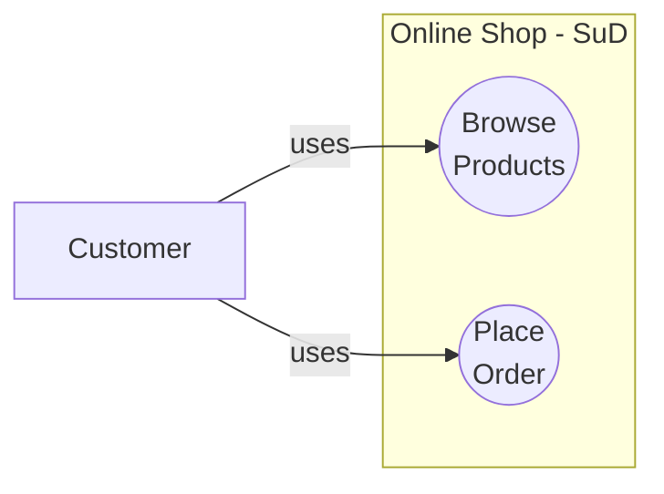

### Relationships Between Use Cases

#### Include (<<include\>\>)
The base use case **always** executes the included use case.

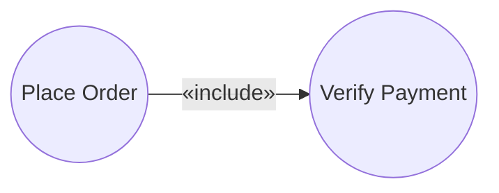

"Place Order" always includes "Verify Payment" — you can't place an order without payment verification.

#### Extend (<<extend\>\>)
The extending use case **optionally** adds behavior to the base use case.

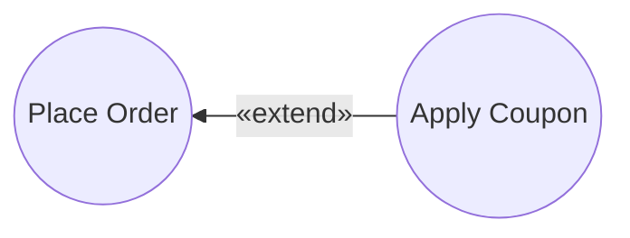

"Apply Coupon" optionally extends "Place Order" — the customer may or may not have a coupon.

#### Actor Generalization
One actor inherits the use cases of another.

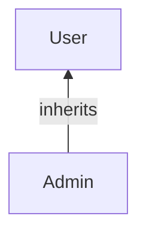

Admin is a specialized User — Admin can do everything a User can, plus admin-specific functions.

::: warning Key Exam Distinction
**Include** = always, mandatory. **Extend** = optional, conditional. The arrow directions are different: include points FROM base TO included; extend points FROM extending TO base.
:::

### Use Case Description (Textual)

A use case diagram gives an overview but not details. Each use case should have a **textual description**:

| Field | Content |
|-------|---------|
| **ID** | UC-03 |
| **Name** | Place Order |
| **Actor** | Customer |
| **Precondition** | Customer is logged in and has items in cart |
| **Main flow** | 1. Customer selects "Checkout" 2. System displays order summary 3. Customer confirms order 4. System processes payment 5. System confirms order |
| **Alternative flows** | 3a. Customer modifies quantity → return to step 2 |
| **Exception flows** | 4a. Payment fails → System displays error, return to step 3 |
| **Postcondition** | Order is recorded; confirmation email sent |

## Activity Diagrams

Activity diagrams model **processes and workflows** — the step-by-step flow of activities with decisions and parallelism.

### Elements

| Element | Symbol | Meaning |
|---------|--------|---------|
| **Initial node** | Filled circle ● | Start of the process |
| **Activity/Action** | Rounded rectangle | A step in the process |
| **Decision** | Diamond ◇ | Branch point (one path taken) |
| **Merge** | Diamond ◇ | Reconnects decision branches |
| **Fork** | Thick bar ━ | Splits into parallel paths |
| **Join** | Thick bar ━ | Synchronizes parallel paths |
| **Final node** | Circle with inner filled circle ◉ | End of the process |
| **Swim lane** | Vertical/horizontal partition | Assigns activities to responsible actors |

### Example: Order Processing

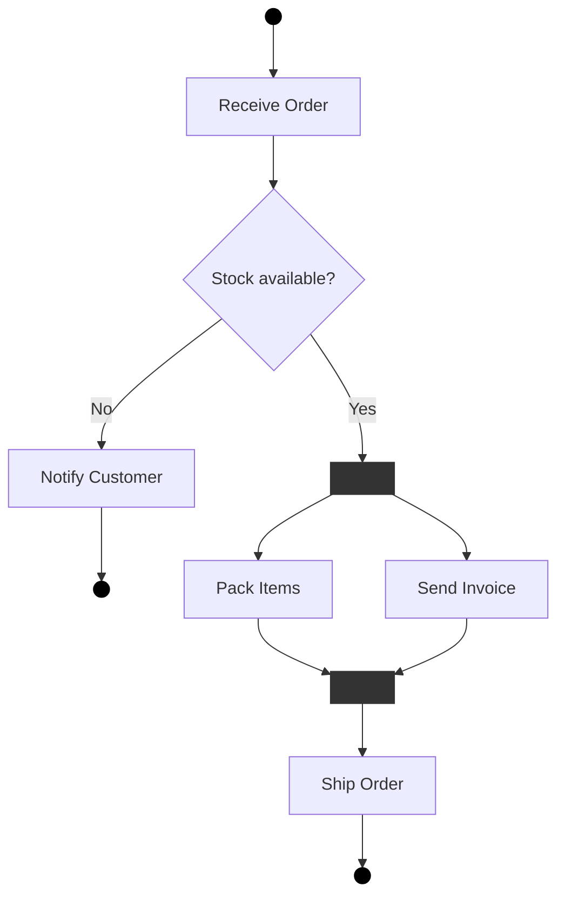

### Swim Lanes

Swim lanes partition activities by **responsibility** — who performs each step.

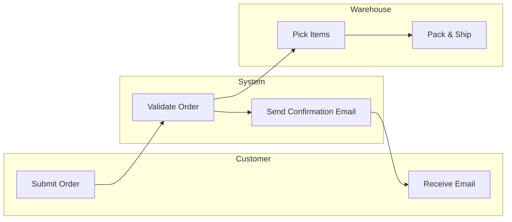

::: tip From Your Experience
As a tester, activity diagrams map directly to test scenarios — each path through the diagram is a test case. As a BA, swim lanes help you assign responsibilities to roles.
:::

## State Machine Diagrams

State machine diagrams show how an **entity changes state** in response to events over its lifecycle.

### Elements

| Element | Symbol | Meaning |
|---------|--------|---------|
| **State** | Rounded rectangle | A condition the entity is in |
| **Transition** | Arrow → | Change from one state to another |
| **Event** | Label on transition | What triggers the transition |
| **Guard** | [condition] | Condition that must be true for transition |
| **Action** | /action | What happens during the transition |
| **Initial state** | Filled circle ● | Starting state |
| **Final state** | ◉ | End of lifecycle |

### Transition Syntax

```
event [guard] / action
```

### Example: Order Lifecycle

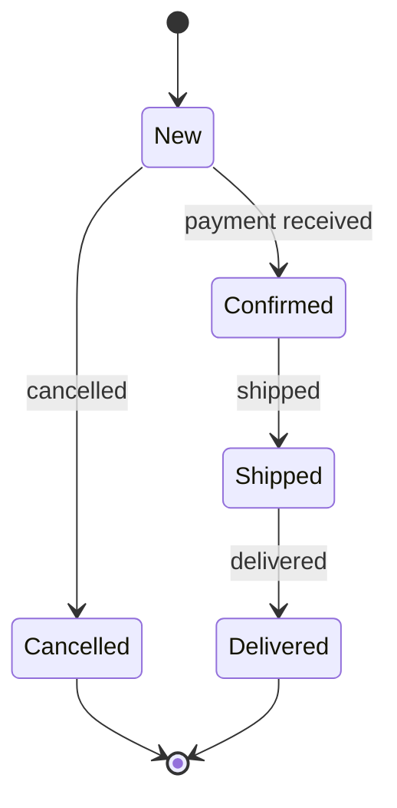

With guard conditions:
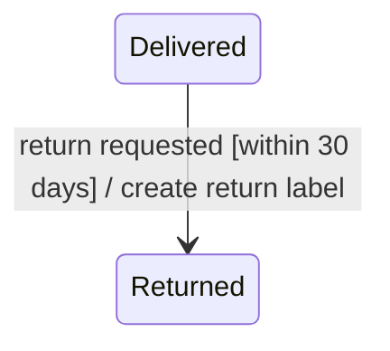

<div class="exam-tip">
  <strong>Exam tip:</strong> Be able to read transition labels in the format <code>event [guard] / action</code>. Questions often ask what event triggers a specific transition or what guard condition applies.
</div>

## Class Diagrams (Data Models)

Class diagrams model the **data structure** of the domain — what entities exist, their attributes, and how they relate to each other.

### Elements

| Element | Meaning |
|---------|---------|
| **Class** | A domain entity (rectangle with name, attributes, operations) |
| **Association** | A relationship between classes (line) |
| **Multiplicity** | How many instances participate (numbers at ends of association) |
| **Generalization** | Inheritance (triangle arrow pointing to parent) |
| **Aggregation** | "Has-a" relationship, parts can exist independently (hollow diamond) |
| **Composition** | "Has-a" relationship, parts cannot exist without the whole (filled diamond) |

### Multiplicity Notation

| Notation | Meaning |
|----------|---------|
| `1` | Exactly one |
| `0..1` | Zero or one (optional) |
| `*` or `0..*` | Zero or more |
| `1..*` | One or more (at least one) |
| `2..5` | Between 2 and 5 |

### Example: E-Commerce Domain Model

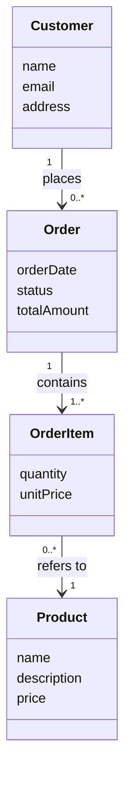

Reading: "One Customer places zero or more Orders. Each Order contains one or more OrderItems. Each OrderItem refers to one Product."

### Generalization (Inheritance)

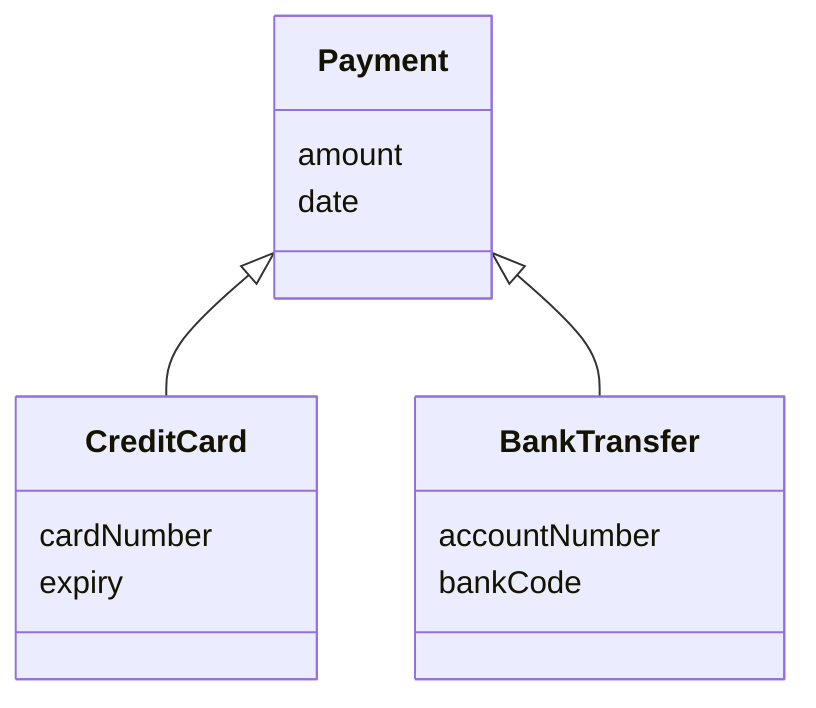

CreditCard and BankTransfer are specialized types of Payment — they inherit `amount` and `date`.

### Aggregation vs. Composition

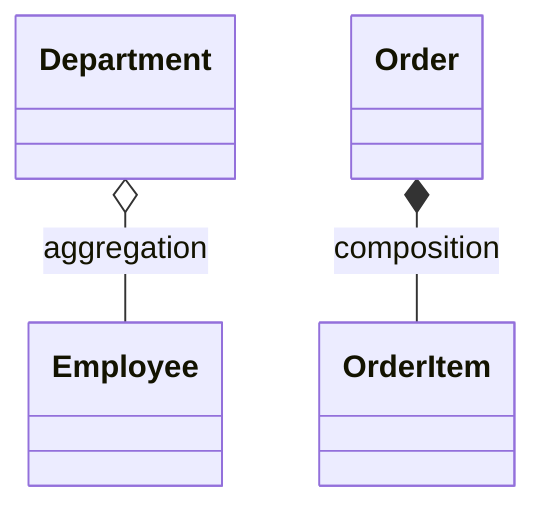

::: warning Key Exam Distinction
**Aggregation** (hollow diamond): the part can exist independently of the whole.
**Composition** (filled diamond): the part cannot exist without the whole — if the whole is deleted, the parts are deleted too.
:::

## Goal Models

Goal models capture the **why** behind requirements — what stakeholders want to achieve.

Goals are decomposed into sub-goals, which eventually lead to concrete requirements.

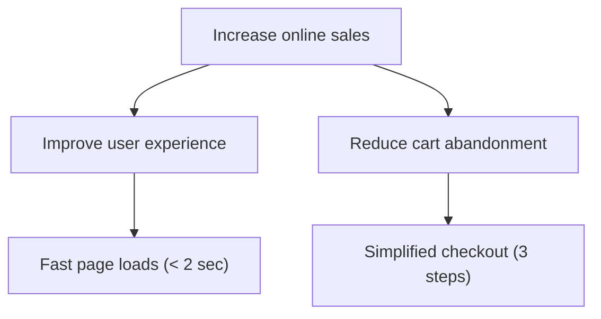

Goal models help:
- **Justify** requirements — every requirement traces back to a business goal
- **Prioritize** — requirements supporting high-priority goals get higher priority
- **Detect conflicts** — conflicting goals produce conflicting requirements

## Choosing the Right Model

| If you need to show... | Use... |
|----------------------|--------|
| What the system does for users | Use case diagram |
| How a process flows step by step | Activity diagram |
| How an entity's state changes over time | State machine diagram |
| The data structure and relationships | Class diagram |
| Why requirements exist | Goal model |

## Practice Quiz

<Quiz :questions="questions" />

---

**Previous:** [← Chapter 5: Natural Language](/v2/chapters/05-natural-language)
| **Next:** [Chapter 7: Validation & Negotiation →](/v2/chapters/07-validation)
