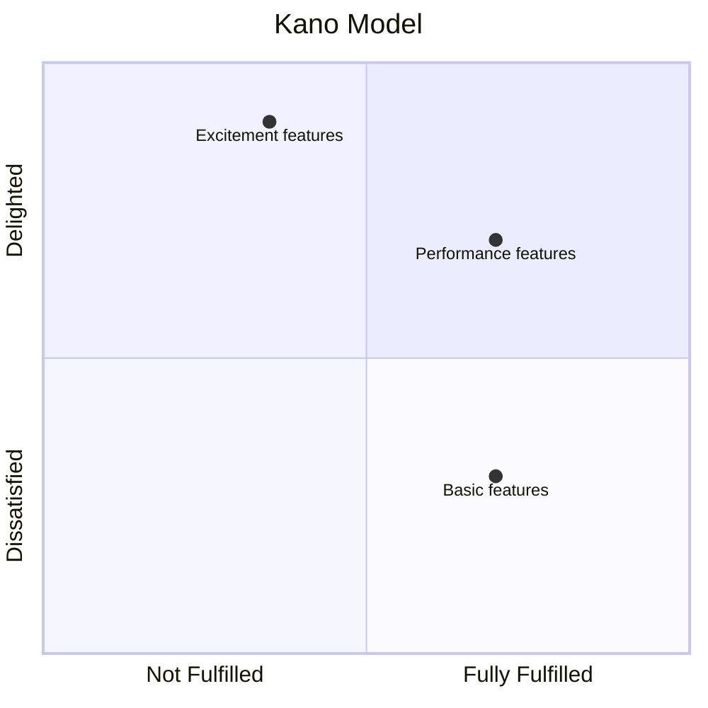
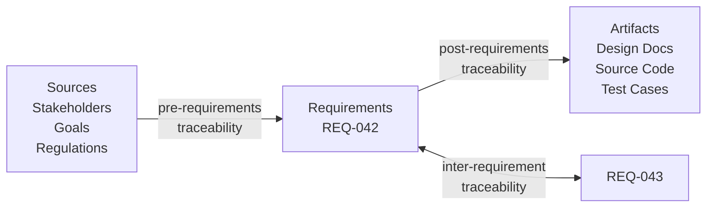
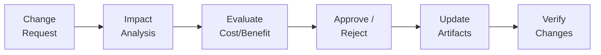

# Chapter 8: Requirements Management

  <strong>Exam weight:</strong> ~13% of questions. Focus on traceability types, prioritization techniques, and change management.

## What is Requirements Management?

Requirements management encompasses the activities needed to **organize, track, and control** requirements throughout the project lifecycle:

- Assigning and maintaining **attributes** (priority, status, source, etc.)
- **Prioritizing** requirements for implementation
- Establishing and maintaining **traceability**
- **Versioning** requirements and managing changes
- Handling **change requests**

## Requirements Attributes

Every requirement should have **metadata** (attributes) that support management activities.

### Common Attributes

| Attribute | Purpose | Example Values |
|-----------|---------|---------------|
| **Unique ID** | Identification | REQ-042, FR-017 |
| **Name/Title** | Quick reference | "Password Reset" |
| **Description** | The requirement text | "The system shall..." |
| **Priority** | Implementation order | Must / Should / Could |
| **Status** | Current state | Draft, Approved, Implemented, Verified |
| **Source** | Who requested it | "Marketing Dept", "EU GDPR Art. 17" |
| **Author** | Who wrote it | "Jane Smith" |
| **Version** | Change tracking | 1.0, 1.1, 2.0 |
| **Risk** | Implementation risk | High, Medium, Low |
| **Stability** | Likelihood of change | Stable, Volatile |
| **Complexity** | Implementation effort | High, Medium, Low |

::: info Key Point
The set of attributes should be **defined at the start of the project** and applied consistently. Too many attributes create overhead; too few leave gaps in management.
:::

## Prioritization

Prioritization determines the **relative importance** of requirements — which to implement first, which to defer, and which to drop.

### Why Prioritize?

- Resources (time, budget, people) are always limited
- Stakeholders always want more than can be delivered
- Prioritization forces trade-off decisions to be made explicitly

### Prioritization Techniques

#### 1. MoSCoW

Categorizes requirements into four groups:

| Category | Meaning | Guideline |
|----------|---------|-----------|
| **M**ust have | Essential — system is unusable without it | ~60% of effort |
| **S**hould have | Important but not critical — workaround exists | ~20% of effort |
| **C**ould have | Desirable — nice to have if time permits | ~20% of effort |
| **W**on't have (this time) | Explicitly out of scope for this release | Deferred |

**Example — Online Shop:**
- **Must**: User login, product search, place order, payment processing
- **Should**: Order history, wishlist, email notifications
- **Could**: Product recommendations, loyalty points
- **Won't** (this release): Mobile app, social media integration

#### 2. Kano Classification

Classifies requirements by their impact on **customer satisfaction**:

| Category | If Present | If Absent | Example |
|----------|-----------|-----------|---------|
| **Basic (Must-be)** | Not noticed — expected | Strong dissatisfaction | Login works reliably |
| **Performance (Linear)** | Satisfaction proportional to quality | Dissatisfaction proportional to lack | Search speed |
| **Excitement (Delighters)** | Strong satisfaction — unexpected bonus | Not missed — wasn't expected | AI-powered recommendations |

::: info Key Insight
Basic requirements are "invisible" when present but cause major dissatisfaction when absent. Excitement features create differentiation. Performance requirements scale linearly.
:::

#### 3. Pairwise Comparison (Wiegers)

Systematically compares every requirement against every other to produce a **relative ranking**.

Process:
1. List all requirements
2. Compare each pair: which is more important?
3. Score each comparison (e.g., 0 = less important, 1 = equally important, 2 = more important)
4. Sum scores to produce a ranking

| | REQ-A | REQ-B | REQ-C | Total |
|---|---|---|---|---|
| **REQ-A** | — | 2 | 1 | 3 |
| **REQ-B** | 0 | — | 0 | 0 |
| **REQ-C** | 1 | 2 | — | 3 |

Result: REQ-A and REQ-C tie at highest priority; REQ-B is lowest.

**Pro**: Produces a well-justified ranking. **Con**: Scales poorly — N requirements need N×(N-1)/2 comparisons.

### Comparison of Techniques

| Technique | Scale | Output | Best For |
|-----------|-------|--------|----------|
| MoSCoW | Simple (4 buckets) | Categories | Sprint/release planning |
| Kano | Customer-focused | Satisfaction categories | Product strategy |
| Pairwise | Precise | Ranked list | Small sets of critical requirements |

## Traceability

**Traceability** is the ability to follow a requirement from its origin, through its specification, to its implementation and verification.

### Types of Traceability

| Traceability Type | Direction | Question Answered |
|-------------------|-----------|-------------------|
| **Pre-requirements** | Requirement ← Source | Why does this requirement exist? Who requested it? |
| **Post-requirements** | Requirement → Artifact | Where is this requirement implemented? How is it tested? |
| **Inter-requirements** | Requirement ↔ Requirement | What other requirements depend on this one? |

### Traceability Matrix

A common tool for managing traceability:

| Requirement | Source | Design | Code | Test Case |
|-------------|--------|--------|------|-----------|
| REQ-001 | Marketing | DD-03 | order.py:45 | TC-001, TC-002 |
| REQ-002 | Legal | DD-04 | auth.py:12 | TC-003 |
| REQ-003 | Users | DD-03 | search.py:8 | TC-004, TC-005 |

### Benefits of Traceability

1. **Impact analysis** — when REQ-002 changes, you immediately see which design docs, code, and tests are affected
2. **Coverage analysis** — find requirements that have no tests (gaps) or tests with no requirements (waste)
3. **Change justification** — trace any artifact back to the business need that justifies it
4. **Regulatory compliance** — many standards (safety, medical, financial) require traceability

::: tip From Your Experience
As a tester, traceability tells you which test cases to update when a requirement changes. As a BA, it lets you answer "what happens if we change this requirement?" — essential for change impact analysis.
:::

## Versioning and Change Management

### Versioning

Requirements evolve — versioning tracks these changes:

- Each requirement has a **version number**
- Changes create a new version, not an overwrite
- The **change history** records who changed what, when, and why
- Old versions remain accessible

### Configuration Management

A **requirements baseline** is a formally agreed-upon snapshot of the requirements at a point in time. It serves as a reference for:
- Development (build against this baseline)
- Testing (test against this baseline)
- Change control (measure changes from this baseline)

### Change Management Process

Changes to baselined requirements must follow a controlled process:

1. **Change request** — someone requests a change (documented)
2. **Impact analysis** — what requirements, designs, code, and tests are affected?
3. **Evaluation** — is the change worth the effort? Risk assessment.
4. **Decision** — approved or rejected by authorized person/board (Change Control Board)
5. **Implementation** — update requirements, design, code, tests
6. **Verification** — confirm the change was implemented correctly

### Change Control Board (CCB)

A group authorized to approve or reject change requests. Typically includes:
- Project manager
- Requirements engineer
- Technical lead
- Key stakeholders

## Practice Quiz

<Quiz :questions="questions" />

---

**Previous:** [← Chapter 7: Validation & Negotiation](/v2/chapters/07-validation)
| **Next:** [Chapter 9: Tool Support →](/v2/chapters/09-tools)
