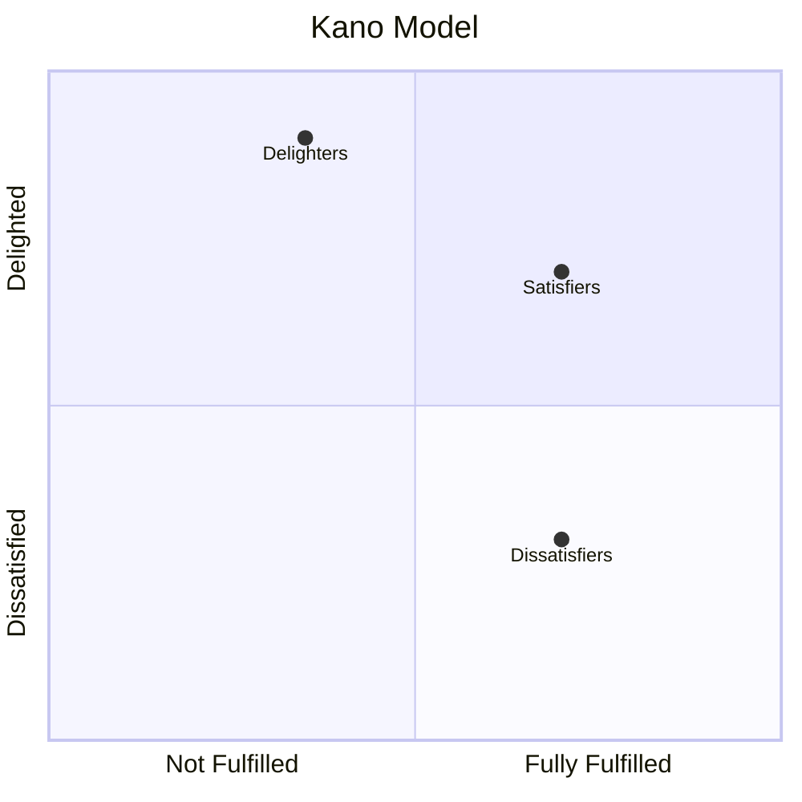

# EU 4: Sources and Elicitation of Requirements

::: info Official Reference
**IREB CPRE-FL Syllabus v3.3.0** — Educational Unit 4, Sections 4.1-4.2 (L3, 4 hours 30 minutes)
[Download syllabus](https://cpre.ireb.org/en/downloads-and-resources/downloads)
:::

  <strong>Exam weight:</strong> ~20% of points (10 questions, 14 points across all of EU 4). Know the three source types, the Kano model categories, and the difference between gathering and design techniques.

See also: [Conflicts and Validation](04b-conflicts-and-validation)

## 4.1 Sources for Requirements (L3)

The quality and completeness of requirements depend greatly on the requirements sources involved. **Missing a relevant source** leads to incomplete understanding or incomplete requirements. Identification of sources is an iterative process requiring constant reconsideration.

### System Boundary and Context Boundary

A shared understanding of the context of the system to be developed is a prerequisite for identifying relevant sources. The area between the **system boundary** and the **context boundary** is the system context (Principle 4).

- The **system boundary** separates the system under development from its surrounding context
- The **context boundary** separates the relevant environment from the irrelevant environment

Clarifying these boundaries and defining the external interfaces between the system and context elements are genuine Requirements Engineering tasks.

### Three Types of Requirements Sources

| Source Type | Examples |
|------------|---------|
| **Stakeholders** | Users, sponsors, managers, developers, authorities, customers, and people impacted by the system |
| **Documents** | Process documents, legal/regulatory documents, company-specific regulations, marketing information |
| **Systems** | Existing and legacy systems |

### Stakeholders as the Main Source

Stakeholders are the main source for requirements. Typical stakeholder roles include:

- **Users** (end-users)
- **Sponsors**
- **Managers**
- **Developers**
- **Authorities**
- **Customers**

People or organizations **impacted** by a system should also be considered as indirect stakeholders.

### Stakeholder Identification and Management

Systematic identification should take place at the **beginning** of a development venture and be managed as a **continuous activity**. This includes identifying both stakeholder roles and persons in those roles.

**Stakeholder relationship management** is an effective way to counter problems with stakeholders. The benefit of systematic stakeholder management is that it ensures stakeholder rights and obligations are clear and their needs are sufficiently addressed.

For end users: aggregate into groups (by similar roles, tasks, or responsibilities). When end users can be identified individually, choose **representatives**. Otherwise, define **personas**.

**Sources for identifying stakeholders:**

- Checklists of typical stakeholder groups and roles
- Organizational structures
- Business process documentation
- Market reports
- Initial stakeholders (to identify additional stakeholders)

### The Stakeholder List

Stakeholders should be documented in an up-to-date list with at least:

- Name
- Function (role)
- Additional personal and contact data
- Temporal and spatial availability
- Relevance
- Area and extent of expertise
- Goals and interests in terms of the project

## 4.2 Elicitation of Requirements (L2)

The Requirements Engineer must understand stakeholders' desires and needs while ensuring requirements from all relevant sources are collected. A major point is turning **implicit** demands, wishes, and expectations into **explicit** requirements.

### The Kano Model

The Kano model classifies requirements into three categories based on their impact on stakeholder satisfaction:

| Category | Synonyms | Behavior |
|----------|----------|----------|
| **Delighters** | Excitement factors, unconscious requirements | Not expected; cause strong satisfaction when present, not missed when absent |
| **Satisfiers** | Performance factors, conscious requirements | Satisfaction is proportional to fulfillment |
| **Dissatisfiers** | Basic factors, subconscious requirements | Taken for granted; absence causes dissatisfaction, presence is not noticed |

### Two Categories of Elicitation Techniques

| Category | Purpose | Targets |
|----------|---------|---------|
| **Gathering techniques** | Investigate different sources to elicit known requirements | Satisfiers and dissatisfiers |
| **Design and idea-generating techniques** | Stimulate creativity to create ideas for solving problems and explore design ideas | Often lead to delighters |

### Gathering Techniques

Four main subcategories:

| Subcategory | Examples |
|-------------|---------|
| **Questioning techniques** | Interviews, questionnaires |
| **Collaboration techniques** | Workshops, focus groups |
| **Observation techniques** | Field observation, contextual inquiry |
| **Artifact-based techniques** | Document analysis, system archaeology |

### Design and Idea-Generating Techniques

Examples include: **brainstorming**, analogies, **prototyping** (e.g., mock-ups), scenarios, and storyboards.

A broader concept is **design thinking**, which offers a wide set of techniques that can be used for requirements elicitation.

### Eliciting Quality Requirements and Constraints

- For quality requirements: use a **quality model** such as **ISO 25010** as a checklist
- For constraints: consider possible restrictions of the solution space — technical, legal, organizational, cultural, or environmental issues

### Choosing Elicitation Techniques

The choice depends on:

- Type of system
- Software development life cycle model
- People involved
- Organizational setup

The best results are usually achieved with a **combination** of different elicitation techniques.

## Practice Quiz

<Quiz :questions="questions" />
